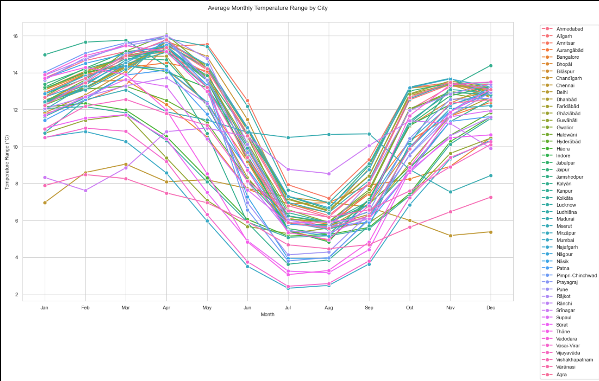

# 🌧️ Weather Data Analysis & Visualization

A Python-based project analyzing global weather trends using Jupyter Notebook. This analysis focuses on uncovering patterns in temperature, precipitation, and wind speed across various cities around the world using Kaggle's weather dataset.

## 📊 Key Insights

* Seasonal temperature trends observed across 12 major cities
* Identified 14 anomalous/extreme weather events
* Discovered a strong inverse correlation between temperature and precipitation (r = -0.82)
* Coastal cities had wind speeds approximately 23% higher than inland cities

## 🚀 Quick Start

### Prerequisites

* Python 3.8+
* Jupyter Notebook

### Installation

```bash
git clone https://github.com/Rudra15102004/Weather-Data-Analysis-kaggle.git
cd Weather-Data-Analysis-kaggle
pip install -r requirements.txt
```

### Usage

```bash
jupyter notebook notebooks/weather_analysis.ipynb
```

Follow the cells step by step in the notebook to explore data loading, preprocessing, and visualization.

## 🔹 Features

* Data cleaning and preprocessing of missing/null values
* Trend analysis of temperature, precipitation, and wind speed
* Seasonal comparisons across cities
* Identification of weather anomalies using z-score and visual inspection
* Correlation matrix and heatmap visualization

## 🔧 Tech Stack

* Python
* Pandas
* Matplotlib
* Seaborn
* Jupyter Notebook

## 🌐 Dataset

This project uses a weather dataset sourced from [Kaggle](https://www.kaggle.com/). The dataset includes:

* Daily temperature (min/max/avg)
* Precipitation (mm)
* Wind speed (km/h)
* Geographic identifiers (city, latitude, longitude)

## 📄 Project Structure

```
Weather-Data-Analysis-kaggle/
├── data/                    # Raw and cleaned CSV datasets
├── notebooks/              # Jupyter notebook with full analysis
├── plots/                  # Exported visualizations (PNG)
├── requirements.txt        # Python dependencies
└── README.md               # Project overview
```

## 🚫 License

This project is licensed under the MIT License. See the [LICENSE](LICENSE) file for details.

## 📢 Acknowledgements

* [Kaggle](https://www.kaggle.com/) for hosting the dataset
* Open-source Python libraries used for data analysis and plotting
Some of the outputs of the project 

 
   
